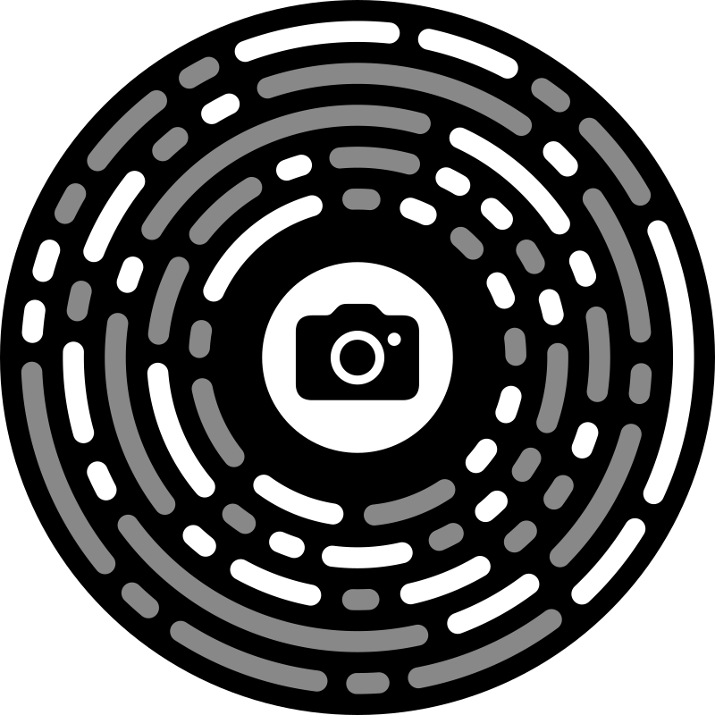

# App Clip Codes, Reverse Engineered



`appclipcode` provides Go and JavaScript/TypeScript implementations of Apple's
App Clip Code format.

Apple ships those circular App Clip Codes, but does not document the format.
This project reverse engineered the full pipeline and rebuilt it in multiple
implementations.

It can:

- generate App Clip Code SVGs from accepted `https://` URLs
- reproduce Apple's URL compression bit-for-bit for generator-accepted URLs
- render the circular code, including palette templates
- decode URLs back from SVGs
- decode from raster images through the CLI and `ReadImage`

Under the hood, it reimplements:

1. URL compression
2. payload encoding with Reed-Solomon error correction
3. App Clip Code SVG rendering

The reverse-engineering write-up lives in [doc/SPEC.md](./doc/SPEC.md).

## Implementations

This repository currently includes two implementations:

- Go: the main library and CLI in the repository root, with generation,
  SVG decoding, and raster-image scanning support
- JavaScript / TypeScript: the package in [`js/`](./js), focused on the
  encoder path and SVG generation, usable directly in the browser, with a
  local `appclipcode` CLI

## Why I Built This

I got interested in this while working on App Clip invocation flows.

Ever played a Netflix game on a TV and paired your phone as the controller? That seamless pairing flow used an App Clip on iPhone, but the code on screen had to be a normal QR code because the controller device might be Android and App Clip Codes are Apple-only. The URL behind it was dynamic, so the code also had to be generated from fresh session state.

Later I was prototyping an iPhone-only install-and-configure flow for NextDNS. Same general problem, but without the cross-platform constraint. A QR code would still have been perfectly sufficient. That made App Clip Codes completely unnecessary and therefore irresistible.

That turned into a reverse-engineering project.

## What Was Hard

Rendering the rings was the easy part. The hard part was matching Apple's actual encoding and validation rules:

- host format selection
- template-word paths
- combined vs segmented non-template encoding
- segmented path/query subtype selection
- generator-compatible URL validation
- the 128-bit payload limit

## LLMs and Reverse Engineering

The LLMs did most of the brute-force exploration. My job was to decide what to test next, supply hypotheses, reject fake progress, and turn the result into a sound implementation. The loop was fairly mechanical: use Apple's generator as the oracle, generate lots of examples, diff outputs, propose a rule, then try to break it with tests.

Claude with Opus 4.6 1M got about halfway there and then failed in a very instructive way. Instead of recovering the missing behavior, it introduced a large hardcoded table of precomputed encodings and then tried to validate the result with tests derived from those same hardcoded answers. It looked like progress until it had to explain what it was actually doing.

Codex with GPT-5.4 at high reasoning was much better at closing the gap. My takeaway is that LLMs can be genuinely useful for reverse engineering if they are doing hypothesis generation under a test harness. Left alone, they are also perfectly capable of building an impressive-looking lie.

## Status

The generator path is reverse engineered and matches Apple's `AppClipCodeGenerator` for accepted URLs.

That includes:

- host format selection
- template-word paths
- combined vs segmented non-template encoding
- segmented path/query subtype selection
- generator-compatible URL validation and the 128-bit payload limit

## Getting Started

### Go

Install:

```bash
go get github.com/rs/appclipcode
go install github.com/rs/appclipcode/cmd/appclipcodegen@latest
```

CLI example:

```bash
appclipcodegen gen https://example.com -o code.svg
```

More details: [doc/GODOC.md](./doc/GODOC.md)

### JavaScript / TypeScript

Install:

```bash
npm install appclipcode
```

CLI example:

```bash
npx appclipcode https://example.com --index 0 -o code.svg
```

The JS library can also run directly in the browser; only the CLI is Node-specific.

More details: [js/README.md](./js/README.md)

## Reverse-Engineering Notes

The full write-up is in [doc/SPEC.md](./doc/SPEC.md).

Some of the more useful findings:

- SPQ and CPQ are standard trie-context Huffman coders
- the non-template selector is `0 = combined`, `1 = segmented`
- segmented mode is a real grammar with typed path and query components
- host format `1` uses a much larger fixed-TLD table than early partial extraction suggested
- the generator validates URL text differently from raw `URLCompression.framework`
- `AppClipCodeGenerator` rejects URLs whose compressed payload exceeds 128 bits, even though the lower-level framework can emit longer raw bitstreams

## License

This project is licensed under the MIT License. See [LICENSE](./LICENSE).

## Disclaimer

This project is an independent, unofficial implementation of the App Clip Code format. It is not affiliated with, authorized by, endorsed by, sponsored by, or otherwise approved by Apple Inc.

Apple, App Clips, and App Clip Code are trademarks of Apple Inc., registered in the U.S. and other countries and regions.
